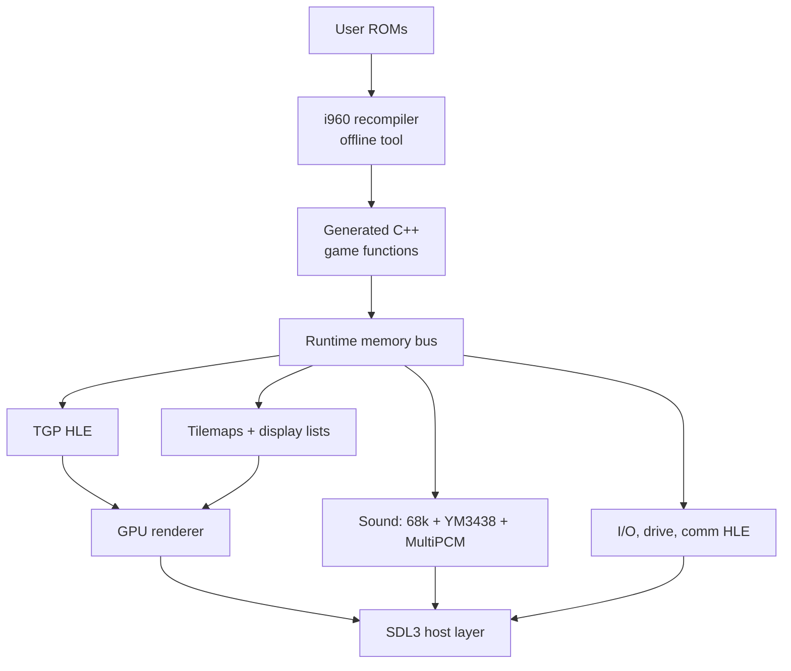

# Daytona USA (Model 2) Static Recompilation — Design Document

Sep 24, 2026 · Ben

## Overview & goals

We statically recompile the i960 game code of Daytona USA (Sega Model 2, 1994) into portable C++, and replace every other board subsystem with high-level or reused emulation, to ship native builds for Windows, macOS and Linux. MAME is the behavioural oracle during development; an original Model 2 PCB is the ground truth when MAME and our build disagree.

**Goals**

- Native x86-64 and ARM64 executables on Windows, macOS (Apple Silicon + Intel) and Linux, from one codebase.
- Frame-exact gameplay parity with the arcade: timing, physics, AI, attract mode, all three courses, all cars.
- User-supplied ROMs only. The repo ships the recompiler, runtime and a ROM-to-build pipeline, never Sega code or assets.
- Modern presentation as opt-in: native resolution, widescreen, higher internal refresh for rendering, filtered textures.
- Real hardware for input: wheel, pedals, 4-speed shifter, force feedback, and cabinet link play over LAN.

**Non-goals (v1)**

- Other Model 2 titles. The recompiler stays generic, but runtime HLE targets Daytona's code paths first.
- Daytona USA 2 (Model 3, PowerPC) and the Saturn / PC ports.
- Recompiling the sound 68000 or the drive/comm board CPUs; those run interpreted (see Audio, inputs, force feedback, link play).

## Target hardware summary

Daytona runs on the original Model 2 board (MAME set `daytona`, driver `sega/model2.cpp`, machine `model2o_state::daytona`), not 2A/2B/2C, so the geometry processor is the Fujitsu TGP rather than a SHARC or TGPx4.

Figures below are confirmed against MAME at `dddd7368` (`src/mame/sega/model2.cpp`, `src/mame/shared/segam1audio.cpp`) and cross-checked against the Model 2 MiSTer core at `591e148e`. They are MAME's figures, not hardware measurements: rule 11 still applies, and the PCB settles anything marked provisional.

| Subsystem | Part (MAME) | Clock (MAME) | Strategy |
| --- | --- | --- | --- |
| Main CPU | Intel i960KB (`I80960KB`), little-endian | `50_MHz_XTAL / 2` = 25 MHz | Static recompilation to C++ |
| Coprocessor | One Fujitsu MB86234 TGP (`m_copro_tgp`); MAME's MB86234 is an empty subclass of its MB86233 | `50_MHz_XTAL` = 50 MHz | HLE in C++, validated against MAME's LLE TGP |
| Geometrizer | Separate from the TGP: walks the display list in buffer RAM at vblank (`geo_parse`, `model2_v.cpp`) | — | Reimplemented; MAME's version is HLE |
| Rasterizer | Sega custom chips; MAME has no device, it is driver code | — | Replaced by host GPU renderer |
| 2D tilemaps / HUD | `S24TILE` (System 24 tilemap chip) | — | Reimplemented, composited on GPU |
| Screen | `set_raw(32_MHz_XTAL/2, 656, 0, 496, 424, 0, 384)` | 16 MHz pixel clock | 496x384 active, 656x424 total |
| Sound | Model 1 sound board (`SEGAM1AUDIO`): 68000 + YM3438 + 2x MultiPCM | 68000 `20_MHz_XTAL / 2` = 10 MHz, YM3438 8 MHz, MultiPCM 10 MHz each | Interpreted 68k + existing FM/MultiPCM cores |
| Main ↔ sound | i8251 UART (uPD71051C) at 0x01c80000 | 31.25 kbit/s (`16_MHz_XTAL / 2 / 16`) | Serial byte stream, not a latch |
| I/O | Model 1 I/O board (`SEGA_MODEL1IO`, BIOS `epr14869c`): own Z80, talks through an MB8421 dual-port RAM at 0x01c00000 | Z80 `32_MHz_XTAL / 8` = 4 MHz | HLE of the dual-port RAM protocol, SDL3 mapping |
| Drive board | SJ25-0207-01 / 838-10646: Z80 + 2x 315-5296 + MSM6253 ADC; commands arrive through the I/O board | Z80 `XTAL(8'000'000)/2` = 4 MHz, "confirmed" | HLE: decode commands, map to SDL haptics |
| Comm board | 837-10537: Z80 + uPD72103 HDLC, program EPR-16726; MAME simulates it (`M2COMM`), no Z80 runs | — | HLE shared-memory protocol over UDP |
| Timers | 4 down-counters at 0x00f00000 | 25 MHz | Runtime device |

**Derived timing.** Refresh = 16,000,000 / (656 x 424) = **57.524 Hz**. Line rate = 16,000,000 / 656 = **24.39 kHz**: medium resolution, not 15 kHz. MAME marks this line `// TODO: from System 24, might not be accurate for Model 2`, so the blanking figures are provisional until measured on a PCB.

**Interrupts.** The board has a 12-bit request register (0x00e80000, write-to-acknowledge by AND) and enable register (0x00e80004, updated 80 ns after the write). MAME routes it to the four i960 lines:

| Request bits | Source in `daytona` | i960 line |
| --- | --- | --- |
| 0 | vblank | IRQ0 |
| 1 | nothing in MAME | IRQ1 |
| 2-5 | timers 0-3 (bits 6-9 unused) | IRQ2 |
| 10 | UART RxRDY or TxRDY | IRQ3 |
| 11 | nothing in MAME | IRQ3 |

Priority is not fixed by the board. MAME takes each line's vector from the i960's ICR and uses `priority = vector / 8`, so the ordering is whatever Daytona programs. **Measured (MAME, `daytona93`):** Daytona sets ICR = `0f0e0d0c` once at boot, so IRQ0-3 take vectors 0x0c-0x0f and all four run at priority 1; no line pre-empts another. In attract only vblank (vector 0x0c, handler 0x0e00) and the sound UART (0x0f, handler 0x0f50) fire; the timers never do. On vblank MAME runs `geo_parse` first (when 60 Hz mode is set, or on even frames in 30 Hz mode, per `videocontrol` bit 0) and then raises bit 0.

**TGP program.** The TGP has no microcode ROM. It holds in halt from reset until the i960 uploads its program: setting `coproctl` bit 31 (0x00980000) routes FIFO writes at 0x00884000 into the 4 K-word program RAM, and clearing it boots the TGP. Daytona's program is 2,024 words, stored in the game's own data ROM (MiSTer core, `tools/extract_tgp_microcode.py`). On the CPU board, `opr-14742a`/`14743a` (`copro_tgp_tables`) are the tables behind the TGP's sin/cos, atan, 1/x and 1/sqrt I/O ports; MAME labels `opr-14744`..`14747` (`other_data`) as further 1/x and 1/sqrt tables. MAME runs this microcode at low level.

## Architecture

The build has three layers: generated game code, a Model 2 runtime that stands in for the board, and a thin host platform layer. Generated code only ever touches the machine through the runtime's memory bus, so the same output runs under a trace harness or in the shipping executable.

The recompiler runs at build time on the user's machine, so no generated Sega code is ever distributed.

**Frame loop.** One host frame = one Model 2 video frame. The runtime runs generated code until the game waits on vblank, fires the vblank interrupt handler, drains the TGP FIFO into a display list, then renders and presents. The sound CPU runs on its own thread in fixed time slices, synced by audio buffer position.

**Memory bus.** Main RAM, work RAM and shared RAM are flat host arrays accessed inline. MMIO ranges (TGP FIFO, geometrizer, tilemap RAM, palette, I/O dual-port RAM, sound UART, comm RAM) go through a page-table of handlers, resolved at compile time where the address is constant.

**Fallback interpreter.** A small i960 interpreter runs any code the recompiler did not reach (unexpected indirect targets, self-test paths). Every fallback hit is logged with its address so the next recompile can include it.

## i960 static recompiler

The recompiler turns the program ROM into one C++ function per i960 procedure, preserving the architectural register file in a context struct so behaviour matches instruction-for-instruction. Optimisation (register promotion, flag elision) comes after parity, never before.

**Pipeline**

1. Load and de-interleave the program ROMs into a flat image using MAME's ROM map for `daytona`.
2. Seed entry points: reset vector, the interrupt table, the fault table, the system procedure table (for `calls`), and any addresses from a hand-maintained `seeds.toml`.
3. Recursive-descent disassembly over the four formats (REG, COBR, CTRL, MEM). Follow `call`, `callx`, `bal`, `balx`, branches and compare-and-branch.
4. Resolve indirect targets: pattern-match jump tables (`ld` from a scaled index then `bx`/`callx`), and merge in targets observed by the MAME tracer (see Reference & validation).
5. Build a CFG per procedure, then emit C++ with one label per basic block and `goto` edges.
6. Emit a dispatch table (address → function pointer) for all indirect calls; misses go to the fallback interpreter.

**Decoder** (`src/i960`, shared by `i960dis` and the recompiler)

- Decoding follows MAME's *executor* (`i960.cpp`), not its disassembler: the executor is the behavioural oracle. The accepted set is exactly what the executor implements: 62 CTRL/COBR/MEM opcodes and 102 REG opcodes. Anything else MAME's disassembler knows (Cx/Hx/Jx additions, `cmpibno`, `cmpibo`, `atadd`, `bswap`, ...) decodes but is marked not executable and goes to the fallback, logged. `0x6e1` is decoded as `movre`, as MAME executes it; it is undocumented.
- Text output reproduces MAME's disassembler syntax exactly, so the two can be diffed as strings (`tests/mame_oracle.cpp` compiles MAME's `i960dis.cpp` unmodified against a small shim).
- Three encodings are read differently by MAME's executor and disassembler. The decoder follows the executor and flags each one (`Insn::quirks`); hardware behaviour for all three is unconfirmed, and any occurrence in Daytona's code is a finding:
  - CTRL/COBR bits 1:0 set: the executor adds them to the branch target (`sext(opcode, 24) - 4`); the disassembler masks them.
  - MEMB bits 6:5 set: the executor ignores them; the disassembler rejects the word.
  - MEMB scale > 4: the executor shifts by it; the disassembler rejects the word.
- The i960 manual (270567-001) is not yet a second check on the decode; the Ghidra SLEIGH cross-check below is the planned one.

**Ghidra as the analysis workbench**

> **Correction (checked 24 Sep 2026):** mainline Ghidra has never shipped an i960 processor module: none in `Ghidra/Processors` at `8e9a8e7a`, none in the last 40 release tags back to 9.2, and no i960 path anywhere in its history. The module in use is the third-party [mumbel/ghidra_i960](https://github.com/mumbel/ghidra_i960) (Apache-2.0, pinned at `727ef787`, fetched by `scripts/fetch_ghidra_i960.sh`), which loads into Ghidra from `Ghidra/Processors/` and into pypcode for the decoder cross-check.
>
> **Cross-check result** (`tests/ghidra_oracle.py`): all 23,258 statically reachable Daytona instructions decode identically in our decoder and in SLEIGH (validity, mnemonic, length, target, operands). On 1,000,000 random words the only differences left are (a) MAME's disassembler printing the integer src1 of `cvtir`/`cvtilr`/`scaler`/`scalerl` as an FP register (MAME's executor and SLEIGH both read an integer; text only), and (b) `movre`: MAME executes 0x6e9 and the undocumented 0x6e1, the module decodes only 0x6e1. Encodings that set bits the KB reserves are flagged as decoder quirks and counted, not compared; none occurs in reachable code.

- Load the de-interleaved program image into Ghidra with its i960 processor module. It becomes the shared, annotated map of the game code.
- Use it to name functions, mark jump tables, label MMIO accesses (TGP FIFO, sound UART, I/O dual-port RAM, comm RAM) and document data structures such as car state and course tables.
- A Ghidra script exports function starts, names and jump-table targets into `seeds.toml`, so every name reaches the generated C++ and trace logs read as `update_car_physics`, not `sub_0001A3F0`.
- Cross-check our disassembler against Ghidra's SLEIGH decode: any mismatch in instruction length, operand or branch target is a bug in one of them. Confirm which i960 variant the module models, since KB FP instructions matter here.
- Findings from MAME traces (indirect targets, code executed from RAM) are imported back into the Ghidra project so the map stays complete.

**Register and state model**

- `ctx.g[16]` globals (g15 = frame pointer), `ctx.r[16]` locals (r0 PFP, r1 SP, r2 RIP), `ctx.ac`, `ctx.pc`, `ctx.tc`, and `ctx.fp[4]` for the i960KB's extended FP registers.
- The condition code lives in `ac`; emit it lazily and only materialise it when a later `bx`/`test`/`modac` or a call boundary reads it.

**Calls and the local register cache**

The i960 saves the 16 local registers on every `call` and restores them on `ret`, via an on-chip cache that spills to the stack frame. The recompiled `call` becomes a C++ call plus an explicit save of `r[]` into the new frame's memory, so code that walks frames or does `flushreg` sees the same stack bytes as hardware. `bal`/`balx` are leaf links through g14 and compile to plain calls with no local save.

**Floating point**

The KB's FPU works in 80-bit extended precision, which ARM64 hosts lack. Any FP op whose result can reach memory or a compare goes through SoftFloat `extF80`; a fast path uses host `double` only where a unit test proves bit-identical results. Physics divergence from wrong rounding is the likeliest source of replay desync, so this is tested first.

**Measured FP use (MAME harvest, `daytona93`).** Of the 23,258 instructions statically reachable from 333 harvested entry points, 108 are FP, and all are conversions, compares and scaling: `cvtri` 39, `cmpr` 37, `cvtir` 22, `scaler` 8, `cvtzri` 2. There is no FP add, subtract, multiply or divide, no transcendental and no `...rl` (extended) form. The geometry maths is on the TGP. 21 of 68 indirect sites are still unexercised, so unreached code may add more; re-measure as coverage grows. For these five operations the extF80 path is small and each can be tested exhaustively or near it.

**As built** (`src/i960/fp.{h,cpp}`, measured operand forms: every one of the 108 FP instructions takes g/l registers, i.e. single precision in and out; never fp0-fp3 or FP literals; AC = `3f001000`, round to nearest, all exceptions masked):

- `ref_*`: the hardware model. Operands widened to extF80, computed and rounded by SoftFloat 3e in any AC rounding mode, IEEE flags reported. Invalid conversions return `0x80000000` (SoftFloat's Intel integer indefinite), unconfirmed for the i960.
- `fast_*`: native host float operations, round to nearest only; this is what recompiled code runs, at native speed. Legal only because `tests/test_fp --exhaustive` proves them bit-identical to `ref_*`: every 2^32 input for cvtri, cvtzri and cvtir, and every 2^32 single for scaler at 11 boundary exponents, 0 mismatches (about 5 minutes on 4 cores). A fast path that rounds like MAME (`std::round`) fails it with 130,905 mismatches in the quick run.
- A different rounding mode, or FP on fp0-fp3, would not have a proven fast path and must go through `ref_*` until one is proven.

**MAME is not a bit-exact FP oracle.** MAME's i960 holds `fp0`-`fp3` as host `double` (`i960.h`, `double m_fp[4]`) and computes in `double`. Wherever Daytona's results depend on the extra bits of extended precision, correct extF80 output and MAME's output disagree, and the lockstep diff will report it. Unresolved; see Open questions.

**Interrupts and faults**

- Interrupts are taken only at safe points: backward branches, calls and returns emit a cheap `if (ctx.irq_pending)` check that dispatches through the interrupt table with the proper `intctl`/priority rules.
- Faults (e.g. integer overflow, alignment) dispatch through the fault table; in practice we log and abort on any unexpected fault during bring-up.

**Code outside ROM**

If the game copies routines into RAM or patches code, the tracer will show execution from RAM. Those regions are recompiled from a RAM snapshot taken after the copy and checked by hash at runtime; a mismatch falls back to the interpreter.

## Geometry (TGP) and rendering

The TGP is replaced by C++ that consumes the same FIFO command stream the i960 writes, and the rasterizer is replaced by a modern GPU backend fed from an intermediate display list. This split lets us diff geometry output against MAME numerically, independent of how pixels end up on screen.

**TGP HLE**

- The i960 uploads the TGP's program, then pushes commands and parameters into the copro FIFO and reads results back from the output FIFO.
- Two units share the geometry work: the TGP (programmable, results can return to the i960) and the geometrizer, which walks the display list in buffer RAM at vblank and transforms, lights, clips and projects polygons for the rasterizer. Which of the two does what for Daytona is established from traces, not assumed.
- MAME runs the TGP microcode at low level (MB86234 = MB86233 core), so we trace its output per command and match it bit-for-bit, including its fixed/float rounding. MAME's geometrizer is HLE in host `float`, so it is a weaker oracle for display-list output than the TGP is for FIFO results.
- Any command that returns results to the i960 (e.g. collision or matrix readback) must return identical values, since game logic depends on them.

**Display list**

One frame's output is a flat list: polygon (4 verts, screen xyz, uv, colour, texture page/format, translucency, fog, sort key) plus tilemap layer state. It is dumpable to disk, which makes renderer bugs reproducible without running the game.

**Renderer**

- Backend: SDL3 GPU API (Vulkan on Linux/Windows, Metal on macOS, D3D12 optional). One shader path, no per-platform shader forks.
- Textures: decode Model 2 texture RAM/ROM formats to RGBA8 atlases on upload, cached by content hash.
- Sorting: reproduce the hardware's priority/z-sort order first; a z-buffer mode is an enhancement toggle, since hardware ordering artefacts are part of the look.
- Tilemaps (HUD, speedometer, course map, text) render as a separate layer at native 496x384 and scale with nearest or sharp-bilinear filtering.

**Enhancements (all off by default)**

| Option | Approach | Risk |
| --- | --- | --- |
| Internal resolution | Render 3D at N× or window size | Low |
| Widescreen | Widen projection in TGP HLE viewport; HUD stays 4:3 centred | Culling pops at screen edges |
| Texture filtering | Bilinear/anisotropic on atlases | Low; atlas padding needed |
| High frame rate | Interpolate display lists between frames | High; logic stays at native rate |
| MSAA | Standard multisample target | Low |

## Audio, inputs, force feedback, link play

These subsystems are small, timing-tolerant and well emulated already, so they are interpreted or HLE'd rather than recompiled.

**Audio**

- Daytona uses the Model 1 sound board, not the SCSP board later Model 2 revisions carry (see Target hardware summary). Its 68000 runs in an embedded interpreter (e.g. Musashi, MIT-licensed) on its own thread; it is cheap at 10 MHz.
- The YM3438 and the two MultiPCMs use proven cores (MAME's `ymopn`/`multipcm`, or others). Licence check before choosing.
- Main CPU ↔ sound CPU traffic is a serial byte stream through an i8251 UART at 31.25 kbit/s. The runtime queues bytes with a timestamp so ordering matches the arcade even across threads. The i960's IRQ3 handler (request bit 10) is the transmit loop: Daytona never polls the UART status (MiSTer core, R87), so the UART interrupt must be modelled or no sound data is sent.
- Output via SDL3 audio at 44.1 kHz with a resampler; the chips' native rates are kept internally.

**Inputs**

| Arcade control | Host mapping |
| --- | --- |
| Steering (ADC) | Wheel axis or gamepad left stick, with deadzone and linearity curves |
| Gas / brake (ADC) | Pedals or triggers |
| 4-speed shifter | H-pattern shifter buttons, or gear up/down on bumpers |
| VR (view) buttons, start | Face buttons |
| Coin, test, service | Keyboard; free-play toggle in settings |

The game's test menu is left intact for calibration, but the runtime also exposes calibrated values directly so players never need it.

**Force feedback**

The game sends motor commands to the drive board through an output port. The HLE decodes them (centering, jolts, road rumble, off-road shake) and maps them to SDL3 haptic effects on wheels, falling back to gamepad rumble. MAME's drive-board notes and output logs are the reference for the command set.

**Link play**

The comm board exposes shared RAM that each cabinet reads in a ring. The HLE implements that ring over UDP with lockstep per frame: each peer sends its outgoing block, waits for the others, then advances. LAN first; internet play needs rollback and is out of scope for v1.

## Reference & validation

Correctness is proven by lockstep differential testing against MAME, frame by frame, with the original PCB used to settle cases where MAME itself may be wrong. No subsystem is "done" until a recorded input replay matches MAME for a full race.

**MAME as oracle**

- Build a patched MAME with a trace plugin (Lua `emu` API plus small C++ hooks in the i960 core and copro FIFO) that records per frame: hash of main/work RAM, i960 register file at vblank, every TGP FIFO word, TGP results returned to the CPU, sound UART bytes, and output ports.
- **As built** (`tools/mame-plugins/m2trace`, format in `docs/trace-format.md`): everything above is reachable from Lua alone through memory write/read taps and `read_range`, so no C++ hook is needed for the first version. The indirect-branch harvest (below) is the one item that still needs a C++ hook or the debugger.
- **Sample point.** A per-frame sample must fall at the same guest instant in both builds, which MAME's end-of-frame notifier does not guarantee: it is not on an instruction boundary our build can reproduce. The default sample is taken inside the i960 store that acknowledges vblank (write to 0x00e80000 with bit 0 clear). That this is once per frame in Daytona is unverified until the first trace.
- Record input as a per-frame ADC/button stream (`.inp`-style, our own format). The same stream drives both MAME and our build. As built, the stream carries each field's mask and default so it is readable without MAME's port definitions, and a replay re-records what the machine saw and is valid only if that matches the stream exactly.
- A diff tool walks both traces and stops at the first divergent frame, then narrows to the first divergent FIFO word or RAM range.
- Also harvest every indirect branch target MAME executes; these feed back into recompiler seeds.

**Original hardware as ground truth**

- Capture from a real Daytona PCB: video via a capture setup that accepts 24 kHz medium resolution (per MAME's timing; confirm on the PCB), audio line out, and (if feasible) a logic analyser on the TGP FIFO bus.
- Use it for: exact refresh rate and frame pacing, polygon sort artefacts, texture filtering look, sound mix levels, and force-feedback behaviour.
- When MAME and hardware disagree, hardware wins and the finding is logged as an upstream MAME note.

**Sega Model 2 MiSTer core (Ben's FPGA project) as a third reference**

- Link: https://github.com/alphanu1/sega-model2-mister (GPL-3). It targets `daytona93` and runs attract mode with sound; 3D does not reach the screen yet.
- The HDL is a readable, hardware-level description of the board: TGP command handling, rasterizer polygon ordering, texture formats and sound board behaviour. Use it to answer questions MAME's source leaves ambiguous.
- A Verilator simulation of the core can emit the same per-frame trace format as the MAME plugin, giving a second independent oracle for the diff tool.
- Running the core on MiSTer gives native-rate video output for side-by-side capture when a real PCB isn't to hand.
- Knowledge flows both ways: divergences found by the recomp's replay tests point at bugs in the core, and vice versa.

**Test tiers**

| Tier | What | When |
| --- | --- | --- |
| Unit | Per-instruction i960 tests vs MAME core, incl. extF80 FP | Every commit |
| Boot | Reset to attract mode, RAM hash match for 600 frames | Every commit |
| Replay | Full race per course from recorded inputs, zero divergence | Nightly |
| Visual | Display-list and screenshot diff vs MAME at native res | Nightly |
| Hardware | Side-by-side capture vs PCB | Per milestone |

## Platform layer & build

One CMake project, C++20, SDL3 for window, input, haptics, audio and GPU, so platform-specific code stays under a few hundred lines. The user runs a first-launch importer that verifies their ROMs and generates the game code locally.

| Platform | Arch | Graphics | Toolchain | Package |
| --- | --- | --- | --- | --- |
| Windows 10/11 | x86-64, ARM64 | Vulkan or D3D12 | MSVC or clang-cl | Zip with exe |
| macOS 12+ | ARM64, x86-64 | Metal | Apple clang | Signed, notarised .app (universal) |
| Linux | x86-64, ARM64 | Vulkan | GCC or clang | AppImage + Flatpak |

**ROM handling**

- The importer accepts a MAME-format `daytona.zip` (or parent/clone set), checks every file against a CRC/SHA1 manifest, and refuses unknown revisions with a clear message.
- It then runs the recompiler and a bundled compiler step, or, simpler for users, loads a prebuilt runtime plus a generated shared library compiled on first run. Decision pending (see Open questions).
- Assets (textures, samples) stay in the ROM images; nothing is extracted to loose files.

**Other runtime features**

- Settings UI (Dear ImGui overlay): controls, enhancements, audio, link peers, DIP-switch equivalents.
- Save states for debugging only, built from the context struct plus RAM; not a player feature in v1.
- Crash reports include the last guest PC and fallback-interpreter hits.

## M1 plan: boot to attract, i960 parity only

M1's exit criterion is "recompiled code reaches attract mode with RAM hashes matching MAME; no graphics" (Test tiers: Boot, 600 frames). It tests the recompiler and the i960 runtime, nothing else, so everything outside the i960 is taken from MAME's trace for now.

**Devices are replayed from the MAME trace.** In 600 frames of attract the i960 reads the TGP FIFO 697,078 times, the I/O board's dual-port RAM 1,127,280 times, plus FIFO status, video control and the sound UART. Those values determine RAM. The TGP is M2's work and the I/O board and sound are M4's, so in M1 the runtime answers every read of a tapped device range with the value MAME returned at the same position in the trace, and checks every device write against the trace. A mismatch is reported with epoch and event index, which is the lockstep diff for free. Untapped MMIO (tilemap, palette) is plain RAM in M1.

**Native execution, no instruction clock.** Generated code is straight C++ over the context struct and the bus; there is no per-instruction cycle counting and no clocked device model in the shipped path (the user's constraint, and the design's). Interrupts are taken at safe points (backward branches, calls, returns). Whether that can match MAME without a clock depends on where MAME takes interrupts. **Measured** (harvest patch logs the IP of each):

| run | interrupts | in the idle loops (0x12b0/0x12b8, 0x12f0/0x12f8) | elsewhere |
| --- | --- | --- | --- |
| attract, 600 frames | 627 | 603 | 24, mostly boot |
| race, 6,000 frames | 10,795 | ~6,450 | ~4,300, nearly all the sound UART (vector 0x0f) in main-line code, e.g. 1,664 at 0x19cfc, 568 at 0x1924c |

vblank (vector 0x0c) lands in an idle loop ~99% of the time, so clockless safe-point delivery matches MAME for it. The UART interrupt does not: during races it lands wherever MAME's approximate cycle count puts it, inside code that does real work between frames. A native build cannot reproduce that without a clock, and MAME's placement is itself an artefact of its cycle estimates (the PCB places it by real bus timing). Open decision, below.

**Register cache.** MAME's i960 keeps 4 frames of local registers on chip: a call with the cache full writes the current set to its own frame, a return above depth 4 reloads it from memory, `flushreg` writes all cached sets. Stack RAM, and so the RAM hashes, depend on this, so the runtime reproduces MAME's model exactly (a depth counter and a 4-slot array, memcpy cost). The real KB spills the oldest set instead; code that reads frame memory without `flushreg` would see the difference. Recorded as a MAME-vs-hardware question; MAME's model is used for lockstep.

**Order of work.**

1. Runtime core: context (g/l registers, AC, PC, TC, IP, register cache), bus (flat RAM arrays for ROM, RAM 0x00200000, work RAM, buffer RAM, backup SRAM; page table for MMIO), trace-replay device, interrupt controller (request/enable registers, ICR, pending table as MAME keeps it).
2. Instruction semantics as inline C++ functions, one per opcode in MAME's executable set, shared by the fallback interpreter and the generated code, so there is one definition of each instruction. FP through `src/i960/fp` fast paths.
3. Fallback interpreter over those semantics. First target: interpreter alone reaches attract with RAM hashes matching MAME for 600 frames. This proves the runtime, the replay and the semantics before any code generation. **Met**: `tools/m1replay` matches all 600 frames (70,926,456 instructions, 1,153 samples, 3,315,201 device events, 627 interrupts). Semantics are MAME's `i960.cpp`, transplanted (BSD-3). Two findings shaped the bus: MAME's multi-word loads and stores advance the address only on regions flagged `BURST` (so a FIFO is popped repeatedly), and buffer RAM is also written by the geometrizer and the TGP, so M1 replays the i960's accesses to it and leaves its hash to M2.
4. Recompiler: per-procedure C++ from `reach` (seeds: boot record + MAME harvest), one label per basic block, dispatch table for indirect targets, misses to the interpreter (logged). Exit: generated code reaches attract with matching hashes for 600 frames, and the interpreter-hit log is empty or explained.

## Milestones, risks, open questions

The critical path is i960 parity, then TGP parity; rendering and polish can proceed in parallel once display lists are stable.

**Milestones**

1. **M0 Tooling:** MAME trace plugin, input recorder, trace diff tool, i960 disassembler.
2. **M1 Boot:** Recompiled code reaches attract mode with RAM hashes matching MAME; no graphics.
3. **M2 Geometry:** TGP HLE matches MAME's FIFO output for attract mode; display lists dump correctly.
4. **M3 Pixels:** GPU renderer draws attract mode and a race at native res; tilemaps and HUD work.
5. **M4 Playable:** Sound, inputs, full-race replay parity on all three courses.
6. **M5 Cabinet feel:** Force feedback, link play on LAN, PCB side-by-side validation.
7. **M6 Ship:** Importer, packaging on all three OSes, enhancements, settings UI.

**Risks**

| Risk | Impact | Mitigation |
| --- | --- | --- |
| Extended-precision FP mismatch | Replay desync, AI/physics drift | SoftFloat extF80 everywhere first; optimise later with proof. Measured: reachable i960 FP is only cvtri/cmpr/cvtir/scaler/cvtzri (108 instructions); no FP arithmetic. Risk much lower than assumed, pending full coverage |
| Indirect branches missed statically | Crashes, fallback slowdown | MAME-harvested targets + interpreter fallback with logging |
| TGP behaviour poorly documented | Wrong geometry, collision | Trace MAME per command; logic-analyse the real bus if needed |
| Hardware sort order hard to reproduce on GPU | Visual artefacts differ | CPU-side sort replicating hardware keys; z-buffer optional |
| Interrupt timing differences | Rare hangs, audio drift | Safe-point IRQ checks; cycle-count estimates per block if required |
| Licensing of reused cores | Can't ship | Pick BSD/MIT cores (MAME's newer files, Musashi); audit early |

**Open questions**

- [ ] Which ROM revision(s) to support first (Japan, export, Special Edition / Hornet)?
- [ ] Does Daytona copy or patch any i960 code in RAM at runtime?
- [x] Lockstep with the sound UART interrupt (fires mid-code during races): **(a)**, decided. The shipped build takes it at safe points at native speed; lockstep tests replay MAME's exact delivery points, keyed by MAME's completed-instruction count, in a test-only harness.
- [ ] Which third-party i960 SLEIGH module to use for Ghidra, if any (mainline has none), and is its licence compatible?
- [ ] Is Daytona entirely interrupt-driven? Static reach from the boot record finds 89 instructions ending in a `b .` idle loop; the MAME harvest shows the vblank handler at 0x0e00 taken 576 times in 600 frames. Seeded with the 107 harvested targets, static reach grows to 13,081 instructions. Consistent with interrupt-driven; confirm by where time is spent.
- [x] Does MAME run the `daytona` TGP at low level or with HLE handlers? **Low level**: the MB86234 core executes the microcode the i960 uploads. Its accuracy against the PCB is still unmeasured.
- [ ] MAME's i960 FP is host `double`. When extF80 and MAME disagree, which does lockstep treat as correct: a MAME-compatible `double` mode for the diff, or a patched MAME with extF80?
- [ ] MAME's `addc` never sets carry (both operands are `uint32_t`, so bit 32 of the sum is always 0; `subc` was fixed upstream, `addc` was not). Does Daytona execute `addc` with a carry-out that matters? Recompile to the silicon and flag the diff, as the MiSTer core does.
- [ ] Does Daytona upload geometrizer code (`geo_prg_w`, 0x00804000), or run its fixed transform loops only?
- [ ] Ship a prebuilt runtime with runtime codegen, or require a local C++ compiler at import?
- [ ] PCB access: which board revision is available, and can the TGP FIFO be probed?
- [ ] Refresh is 57.524 Hz per MAME (provisional; PCB unmeasured). Should frame pacing lock to host 60 Hz or run at native rate with VRR?
